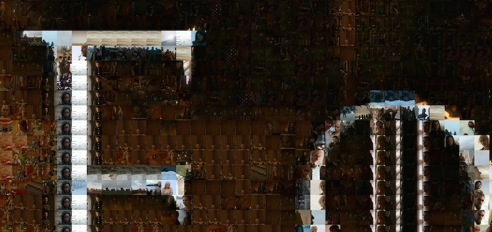

# `mosaic`: a Python script to generate photographic mosaic images

This utility script can be used to generate [photo-mosaic](http://en.wikipedia.org/wiki/Photographic_mosaic) images.

## Requirements
To use it you must have [Python](https://www.python.org/) installed, along with the [Pillow](http://pillow.readthedocs.org/en/latest/) imaging library.
It works on both Python 2 and Python 3. You can install PIP with this command, if you use [pip](https://pip.readthedocs.io/) or the other command if you use [conda](https://conda.io/docs/):

```bash
$ pip install Pillow  # if you use pip, you might need 'sudo'
$ conda install Pillow  # if you use conda, you might need 'sudo'
```

## Required images
You will need an image to use for the photo-mosaic ([most common image formats are supported](http://pillow.readthedocs.org/en/latest/handbook/image-file-formats.html)), as well as a large collection of different images to be used as tiles. The tile images can be any shape or size (the utility will automatically crop and resize them) but for good results you will need a lot of them - a few hundred at least.

One convenient way of generating large numbers of tile images is to [extract screenshots from video files](https://trac.ffmpeg.org/wiki/Create%20a%20thumbnail%20image%20every%20X%20seconds%20of%20the%20video) using [ffmpeg](https://www.ffmpeg.org/).

## How to run
Run the utility from the command line, as follows:

```bash
$ python mosaic.py <input_image> <tiles directory> <output_image> [--gray]
```

*   The `input_image` argument should contain the path to the image for which you want to build the mosaic
*   The `tiles directory` argument should contain the path to the directory containing the tile images (the directory will be searched recursively, so it doesn't matter if some of the images are contained in sub-directories)
*   The `output_image` argument should contain the path to the output image (default to 'mosaic.jpeg')

## Example
For example:

```bash
$ python mosaic.py game_of_thrones_poster.jpg /home/admin/images/screenshots got_mosaic.jpg
```

The images below show an example of how the mosaic tiles are matched to the details of the original image:

[](examples/mosaic_small.jpg)
Original image (® HBO).

[](examples/mosaic_large.jpg)  
Mosaic Detail (click through for [full mosaic](examples/mosaic_large.jpg) ~15MB).

----

## Note on running time

Producing large, highly detailed mosaics can take some time - you should experiment with the various [configuration parameters](mosaic.py#L16) explained in the source code to find the right balance between image quality and render time.

## Note on parameters

In particular the [`TILE_MATCH_RES`](mosaic.py#L22) parameter can have a big impact on both these factors - its value determines how closely the program examines each tile when trying to find the best fit for a particular segment of the image.
- Setting `TILE_MATCH_RES` to `1` simply finds the average colour of each tile, and picks the one that most closely matches the average colour of the image segment. As the value is increased, the tile is examined in more detail.
- Setting `TILE_MATCH_RES` to equal `TILE_SIZE` will cause the utility to examine each pixel in the tile individually, producing the best possible match (during my testing I didn't find a very noticeable improvement beyond a value of 5, but YMMV).

By default the utility will configure itself to use all available CPUs/CPU-cores on the host system, if you want to leave some processing power spare for other tasks then adjust the [`WORKER_COUNT`](mosaic.py#L28) parameter accordingly.

----

## :scroll: License ? [](https://github.com/Naereen/mosaic/blob/master/LICENSE)
[MIT Licensed](https://lbesson.mit-license.org/) (file [LICENSE](LICENSE)).
Copyright (c)
© [Rob Dawson](https://GitHub.com/codebox), 2014-2016,
© [Lilian Besson](https://GitHub.com/Naereen), 2018.

[](https://GitHub.com/Naereen/mosaic/graphs/commit-activity)
[](https://GitHub.com/Naereen/ama)
[](https://GitHub.com/Naereen/mosaic/)

[](https://GitHub.com/Naereen/)

[](http://ForTheBadge.com)
[](https://GitHub.com/)
